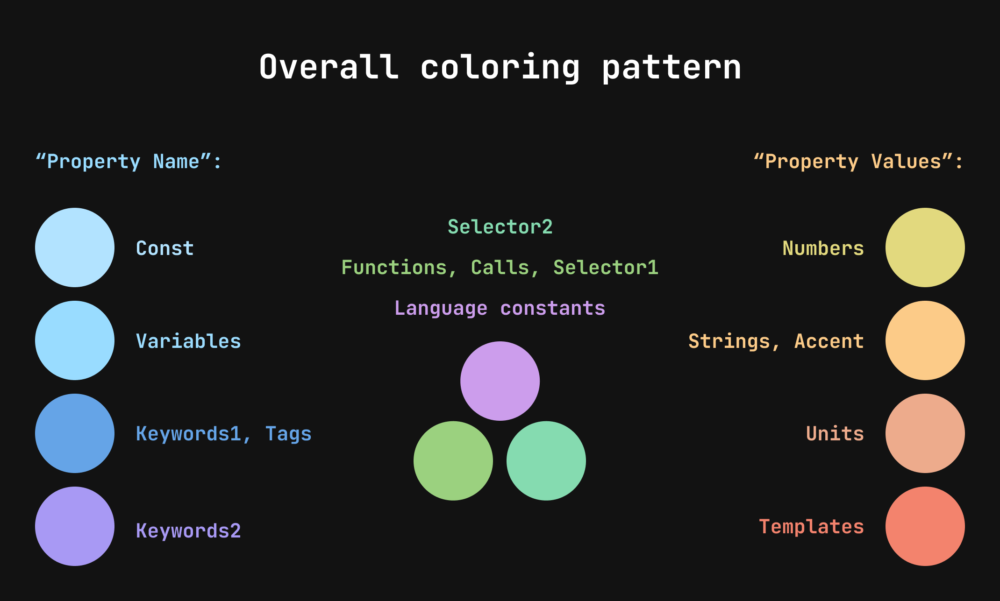

# Cosmical Theme 👨🏼‍🚀🚀

A Space-inspired **Dark theme** for those who like the default Dark+ visuals. It comes with a neutral background and a **carefully picked color palette** that blends in very nicely.

Cosmical creates it's **own visual language** by balancing the use of color and contrast to create a hierarchy of importance. This **coloring pattern** helps distinguish the code elements.

It aims to be **an alternative for those who like the default dark look** while being a **completely new theme**, not just an upgrade.

🌌 It will make you feel like you are an astronaut coding in space! 🌌


<br>

## Installing

1. Click here: [Cosmical theme vscode martketplace](https://marketplace.visualstudio.com/items?itemName=jorgemrtr.cosmical) to visit the VSCode marketplace website.
2. Clicking "Intall" will open VSCode and the Cosmical theme extension page.
3. Click on "Install" and "Set Color theme".

or

1. Open **extensions** on the left side bar (`ctrl + shift + X` on Windows).
2. Search for "Cosmical" in the input field and click on the extension.
3. Click on "Install" and "Set Color theme".

<br>

# Features:

## Colors

- A beautiful and well-thought color palette to provide amazing contrast and color distinction, making a nicely balanced theme.
- The primary colors are golden and blue
- The different parts of the code can be distinguished by color and contrast following a hierarchy of importance.
- To help the user, this theme follows its own coloring pattern across different file formats.

## Background

- Neutral background following the material guidelines for dark themes.
- Non-blueish background to improve sleep by decreasing blue-light exposure.
- Provides a good amount of contrast following accessibility guidelines without being too high contrast.

## Visual language / Coloring pattern



As seen in the image above Cosmical uses a **coloring pattern** divided by groups: Golden, Blue and Neutral.
To give you an example of this pattern in action, imagine a `.json` or `.css` file:

- In the **Blue group** (purple, dark-blue, blue) is everything related to language, variable names, property names, keywords...
- In the **Golden group** (orange, golden, yellow) is everything related to property values, strings, numbers...
- In the **Neutral group** (green, violet) is everything that isn't in the other groups, things like selectors, function calls, language constants(null, true)

This pattern is consistent across all the different file formats.
<br>

# Why it was created?

It all started when I was looking for a theme to stick with in my VSCode. After trying a lot of themes from the marketplace, I always came back to the default Dark+, everything else felt weird.  
So I decided to do some minor tweaking to Dark+ in the settings, starting with the backgrounds and other UI elements. I continued tweaking it till it wasn't Dark+ anymore.

After reading [Creating a VS Code Theme - CSS tricks](https://css-tricks.com/creating-a-vs-code-theme/), I decided to create my own theme and publish it.

If you use **Dark+**, this theme will be **familiar to you** as Cosmical is heavily influenced by it, aiming to be **an alternative for those who like the default dark look** while being a **completely new theme**, not just an upgrade.

<br>

# Contributing

This is my first theme release and it's only tested for Javascript, React, Svelte, HTML, CSS.

After a lot of recent changes, in order to improve the theme and add better support. I think that I've finally landed on a color placement and palette that feels good, so changes won't be that drastic from now on.

Feedback is appreciated! If you want to contribute, please check the github repo: https://github.com/jorgemrtr/cosmical-theme

<br>
<br>
<br>

# Recomended settings (Optional)

These are some of my favourite settings based on my personal setup, you can change VSCode settings by:

```
Opening command palette (ctrl + shift + P)
Typing "Open Settings (JSON)"
Copy the following settings to your JSON inside the brackets

```

## 1. Braket Pairing indent lines

This setting is built in VSCode. I only turn on the option that draws colored vertical and horizontal lines because I find that the actual bracket colorization makes reading the code confusing.

```
"editor.bracketPairColorization.enabled": false,
"editor.guides.bracketPairs": true,
"editor.guides.bracketPairsHorizontal": true,
```

#### Comparison:

##### Brackets Pairs Off


##### Brackets Pairs On


<br>

## 2. Custom Font: "JetBrains Mono"

I feel like "JetBrains Mono" makes reading code a lot nicer than the default 'Consolas' font. You can install it from [Google fonts](https://fonts.google.com/specimen/JetBrains+Mono#standard-styles)

```
"editor.fontFamily": "'JetBrains Mono', 'Consolas', 'monospace'",
```

It also comes with ligatures that can make you code more aesthetic but can be confusing. They come disabled by default in VSCode

```
"editor.fontLigatures": true,
```

<br>

## 3. Icon Pack: "Material Icon Theme"

My recommendation for an icon pack is "Material Icon Theme" by Philipp Kief.Having an icon pack helps you differentiate the content inside your project.

I like to turn down saturation a bit so it isn't too distracting:

```
"material-icon-theme.saturation": 0.8,
```
